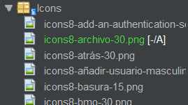
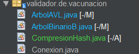
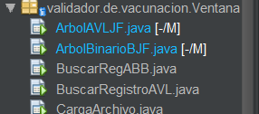
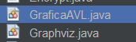

# Bienvenidos al Manual Tecnico
## Porgrama de Validacion de vacunas contra Covid-19

En este programa esta presente el esencial uso de los Arboles Binarios, tanto el de Busqueda (ABB) como el AVL.

El programa esta dividido en diferentes paquetes, el paquete de **Iconos** que es donde se encuentran las imagenes utilizadas.

<div style="text-align: center;">
  
</div>
<br/>

Hay otro paquete donde se guardaron las **Clases**.

<div style="text-align: center;">
  
</div>
<br/>

Y por ultimo otro paquete que contiene las ventanas **Jframe**.
<div style="text-align: center;">
  
</div>
<br/>

## Arbol Binario ABB

Este arbol encuentra en sus propias clases llamadas **NodoArbolBinario** y **ArbolBinarioB**.

Dentro de la clase **NodoArbolBinario** solo se encuentran sus respectivos campos:
```java
public String nombre, depa, muni, fecV1, fecV2, fecV3, lugarV;
    public int cantDosis;
    public long dpi;
    public NodoArbolBinario hijoizq, hijoder;
    
    public NodoArbolBinario(String nom, long dpi){
        this.nombre=nom;
        this.dpi=dpi;
        this.depa=null;
        this.muni=null;
        this.fecV1=null;
        this.fecV2=null;
        this.fecV3=null;
        this.lugarV=null;
        this.cantDosis=0;
        this.hijoder=null;
        this.hijoizq=null;
    }

```

Y en la clase **ArbolBinarioB** se encuentra lo esencia, agregar nodo, buscar nodo, eliminar nodo, y los 3 recorridos posibles y otros cuantos metodos para el llenado de archivos.
```java
//Metodo para insertar un nodo en el arbol
    public void AgregarNodo(String nom, long dpi) {
        NodoArbolBinario nuevo = new NodoArbolBinario(nom, dpi);
        if (raiz == null) {
            raiz = nuevo;
        } else {
            NodoArbolBinario aux = raiz;
            NodoArbolBinario padre;

            while (true) {
                padre = aux;

                if (dpi < aux.dpi) {
                    aux = aux.hijoizq;
                    if (aux == null) {
                        padre.hijoizq = nuevo;
                        return;
                    }
                } else {
                    aux = aux.hijoder;
                    if (aux == null) {
                        padre.hijoder = nuevo;
                        return;
                    }
                }
            }
        }
    }
 ```   
 etc.

 ## Arbol Binario AVL

 Este arbol AVL se compone de 2 respectivas clases, la clase **NodoArbolAVL** y **ArbolAVL**.

 Dentro de la clase **NodoArbolAVL** se encuentra los respectivos campos que llevara cada nodo del arbol:
 ```java
 public class NodoArbolAVL {
    public String nombre, depa, muni, fecV1, fecV2, fecV3, lugarV;
    public int cantDosis, fe;
    public long dpi;
    public NodoArbolAVL hijoIzq, hijoDer;
    
    public NodoArbolAVL(String nom, long dpi){
        this.nombre=nom;
        this.dpi=dpi;
        this.depa=null;
        this.muni=null;
        this.fecV1=null;
        this.fecV2=null;
        this.fecV3=null;
        this.lugarV=null;
        this.cantDosis=0;
        this.hijoDer=null;
        this.hijoIzq=null;
        this.fe=0;
    }
}
```

Y en la clase **ArbolAVL** se encuentran los respectivos metodos de insertar nodo, buscar nodo, eliminar nodo y sus recorrido.

Un dato muy peculiar que a la hora de insertar nodo, se manda a llamar distintos tipos de metodos dentro de esta clase los cuales son **RotacionIzquierda**, **RotacionDobleIzquierda**, **RotacionDerecha** y **RotacionDobleDerecha**:
```java
//Rotacion simple Izquierda
    public NodoArbolAVL rotacionIzquierda(NodoArbolAVL c) {
        NodoArbolAVL aux = c.hijoIzq;
        c.hijoIzq = aux.hijoDer;
        aux.hijoDer = c;

        c.fe = Math.max(ObtenerFE(c.hijoIzq), ObtenerFE(c.hijoDer)) + 1;
        aux.fe = Math.max(ObtenerFE(aux.hijoIzq), ObtenerFE(aux.hijoDer)) + 1;

        return aux;
    }

    //Rotacion simple Derecha
    public NodoArbolAVL rotacionDerecha(NodoArbolAVL c) {
        NodoArbolAVL aux = c.hijoDer;
        c.hijoDer = aux.hijoIzq;
        aux.hijoIzq = c;

        c.fe = Math.max(ObtenerFE(c.hijoIzq), ObtenerFE(c.hijoDer)) + 1;
        aux.fe = Math.max(ObtenerFE(aux.hijoIzq), ObtenerFE(aux.hijoDer)) + 1;

        return aux;
    }

    //Rotacion Doble a la Izquierda
    public NodoArbolAVL rotacionDobleIzquierda(NodoArbolAVL c) {
        NodoArbolAVL temp;
        c.hijoIzq = rotacionDerecha(c.hijoIzq);
        temp = rotacionIzquierda(c);

        return temp;
    }

    //Rotacion Doble a la Derecha
    public NodoArbolAVL rotacionDobleDerecha(NodoArbolAVL c) {
        NodoArbolAVL temp;
        c.hijoDer = rotacionIzquierda(c.hijoDer);
        temp = rotacionDerecha(c);
        return temp;
    }
```


### Eso es lo esencial de cada uno de los arboles Binarios, tanto el ABB como el AVL.

## Guardado y cargado de archivos .txt

Dentro de este programa se hizo la utilizacion de muchos archivos .txt con informacion, y por lo tanto se crearon muchos metodos de carga de archivos y guardado de archivos, todo esto se encuentra dentro de la clase **Conexion**:
<div style="text-align: center;">
  
</div>

Dentro de esta clase se encuentran distintos metodos que son llamados en distintas partes del programa, por eso son esenciales, metodos como **cargarTxt**, **cargarTxtpersonalizado**, **guardarABBTXT**, **guardarAVLTXT**, entre otros, aqui hay un ejemplo:

```java
public void cargarTxt(String direccion, long cant) {
        try {
            long parar = 0;
            BufferedReader bf = new BufferedReader(new FileReader(direccion));
            String linea;
            while (parar < cant) {
                linea = bf.readLine();

                if (linea == null) {
                    JOptionPane.showMessageDialog(null, "Inscripciones procesadas correctamente");
                    return;
                }

                String dpis = "";
                String nombre = "";
                boolean separacion = false;

                for (int i = linea.length() - 1; i >= 0; i--) {
                    char caracter = linea.charAt(i);
                    if ((caracter == ' ' || caracter == '\t') && !separacion) {
                        separacion = true;
                    }
                    if (!separacion) {
                        dpis = caracter + dpis;
                    } else {
                        nombre = caracter + nombre;
                    }
                }

                try {
                    long dpi = Long.parseLong(dpis.trim());
                    arbol.AgregarNodo(nombre, dpi);
                    arbolAVL.insertar(nombre, dpi);

                } catch (NumberFormatException e) {
                    System.out.println("DPI no valido en el registro: " + linea);
                }
                parar = parar + 1;
            }

            JOptionPane.showMessageDialog(null, "Inscripciones procesadas correctamente");
        } catch (Exception e) {
            JOptionPane.showMessageDialog(null, "No se pudieron procesar las inscripciones");
        }
    }
```
```java
public boolean guardarABBTXT(NodoArbolBinario raiz, String rutaArchivo) {
        try (BufferedWriter writer = new BufferedWriter(new FileWriter(rutaArchivo))) {
            // Obtener arbol InOrden
            String registro = arbol.obtenerInOrden(raiz);

            // Escribir el registro
            writer.write(registro);
            return true;
        } catch (IOException e) {
            e.printStackTrace();
            return false;
        }
    }
```

## Encriptado y desencriptado de datos
Dentro del programa es esencial el encriptado de los datos, por eso existe una clase especifica que trata sobre el encripatado de datos, esta clase se llama **Encrypt** que tiene el metodo de encriptado y desencriptado Ceasar:

<div style="text-align: center;">
  
</div>

Los metodos son: 

```java
private static final String CHAR_LIST
            = "ABCDEFGHIJKLMNOPQRSTUVWXYZabcdefghijklmnopqrstuvwxyz"
            + "ÁÉÍÓÚáéíóúÑñÜü";

    public Encrypt() {

    }

    public static String encriptar(String text, int shift) {
        if (text != null && !"null".equals(text)) {
            StringBuilder result = new StringBuilder();
            for (int i = 0; i < text.length(); i++) {
                char ch = text.charAt(i);
                if (Character.isDigit(ch)) {
                    // Manejar encriptación para dígitos
                    char base = '0';
                    ch = (char) ((ch - base + shift) % 10 + base);
                    result.append(ch);
                } else {
                    int index = CHAR_LIST.indexOf(ch);
                    if (index != -1) {
                        int shiftedIndex = (index + shift) % CHAR_LIST.length();
                        result.append(CHAR_LIST.charAt(shiftedIndex));
                    } else {
                        result.append(ch);
                    }
                }
            }
            return result.toString();
        } else {
            return null;
        }
    }

    public static String desencriptar(String text, int shift) {
        if (text != null && !"null".equals(text)) {
            StringBuilder result = new StringBuilder();
            for (int i = 0; i < text.length(); i++) {
                char ch = text.charAt(i);
                if (Character.isDigit(ch)) {
                    // Manejar desencriptación para dígitos
                    char base = '0';
                    ch = (char) ((ch - base - shift + 10) % 10 + base);
                    result.append(ch);
                } else {
                    int index = CHAR_LIST.indexOf(ch);
                    if (index != -1) {
                        int shiftedIndex = (index - shift + CHAR_LIST.length()) % CHAR_LIST.length();
                        result.append(CHAR_LIST.charAt(shiftedIndex));
                    } else {
                        result.append(ch);
                    }
                }
            }
            return result.toString();
        } else {
            return null;
        }
    }
```
Estos metodos lo que realizan es la encripcion y desencripcion del arbol, luego de eso puede hacer uso del guardado del archivo txt.

## Graficar Arboles
Se cuenta con una clase especifica para cada arbol Binario, la cual hace la impresion de cada uno de los nodos dentro de un circulo, estas son las clases contenedoras de los metodos:
<div style="text-align: center;">
  
</div>

Las cuales tienen los metodos **paint** que es heredado y sobre cargado y el metodo propio **Pintar**:
```java
private ArbolAVL arbolAVL;
    public static final int diametro = 50;
    public static final int radio = diametro / 2;
    public static final int ancho = 50;

    public void setArbol(ArbolAVL arbol) {
        this.arbolAVL = arbol;
        repaint();
    }

    @Override
    public void paint(Graphics g) {
        super.paint(g);
        pintar(g, getWidth() / 2, 20, arbolAVL.raizAVL);
    }

    public void pintar(Graphics g, int x, int y, NodoArbolAVL r) {
        if (r != null) {
            int espacio = arbolAVL.nodosCompletos(r) * ancho/ 2;
            
            g.setColor(Color.BLACK);
            g.drawOval(x, y, diametro, diametro);
            
            g.setColor(Color.BLUE);
            g.setFont(new Font("Serif", Font.BOLD, 12));
            g.drawString(String.valueOf(r.dpi).toString(), x+5, y + 18);
            
            g.setColor(new Color(128, 0, 128));
            g.setFont(new Font("Serif", Font.ITALIC, 12));
            g.drawString(r.nombre.toString(), x-25, y + 30);

            if (r.hijoIzq != null) {
                g.setColor(new Color(0, 100, 0));
                g.drawLine(x, y + radio, x + radio - ancho - espacio, y + ancho);
            } 
            
            if (r.hijoDer != null) {
                g.setColor(new Color(0, 100, 0));
                g.drawLine(x + diametro, y + radio, x + radio + ancho + espacio, y + ancho);
            }

            pintar(g, x - ancho - espacio, y + ancho, r.hijoIzq);
            pintar(g, x + ancho + espacio, y + ancho, r.hijoDer);

        }
    }
```

Estos metodos permiten pintar un Jframe con una grafica que define cada uno de los nodos del respectivo arbol en donde se utilice.

## Comprimir Arboles
Se cuenta con una clase especifica de compresion llamada **CompresionHash** donde existen metodos que guardan un .txt con los datos comprimidos y otros donde agarran un .txt, lo descomprimen y lo ingresan al arbol, esta es la clase:
<div style="text-align: center;">
  
</div>

Algunos de los metodos dentro de ella son: 
```java
public void guardarRegistros(NodoArbolBinario raiz) {
        if (raiz != null) {
            tablaHash.put(String.valueOf(raiz.dpi), raiz);
            guardarRegistros(raiz.hijoizq);
            guardarRegistros(raiz.hijoder);
        }

    }

    // Método para escribir los datos de la tabla hash en un archivo de texto
    public boolean guardartxt(String rutaArchivo) {
        try {
            String tablaHashTxt = "TablaHashABB.txt";
            FileWriter writer = new FileWriter(rutaArchivo);
            for (String clave : tablaHash.keySet()) {
                writer.write(clave + "\n");
            }
            FileWriter writer2 = new FileWriter(tablaHashTxt);
            for (String clave : tablaHash.keySet()) {
                NodoArbolBinario nodo = tablaHash.get(clave);
                StringBuilder sb = new StringBuilder();
                sb.append(nodo.nombre).append("|").append(nodo.dpi).append("|").append(nodo.cantDosis).append("|")
                        .append(nodo.fecV1).append("|").append(nodo.fecV2).append("|").append(nodo.fecV3).append("|")
                        .append(nodo.lugarV).append("|").append(nodo.depa).append("|").append(nodo.muni).append("\n");
                writer2.write(sb.toString());
            }
            writer.close();
            writer2.close();
            return true;
        } catch (IOException e) {
            return false;
        }

    }
```

Eso es todo con respecto a las clases esenciales para el uso del programa.

# Ventanas

Existen una gran variedad de ventanas:
<div style="text-align: center;">
  
</div>

Pero en estas ventanas unicamente se hace el llamado a los metodos correspondientes de las clases anteriores por medio de botones, por lo tanto solo se debe observar a que metodo se dirige al presionar el boton y se comprenderá correctamente

### Ejemplo:
#### Imprimir datos 
<div style="text-align: center;">
  
</div>

Cualquiera de esos botones manda a llamar a su metodo correspondiente y llena su respectiva tabla:
```java
private void jbtnPreOrdenMousePressed(java.awt.event.MouseEvent evt) {                                          
        if(!arbB.estaVacio()){
            limpiarTabla();
            DefaultTableModel modelo= new DefaultTableModel(new String[]{"Nombre","DPI","Cantidad de vacunas", "Fecha vacuna 1", "Fecha vacuna 2","Fecha vacuna 3","Lugar de Vacunacion","Departamento Vivienda","Municipio Vivienda"}, 0);
            jTRegistros.setModel(modelo);
            
            arbB.PreOrden(arbB.raiz, modelo);
            
        }else{
            JOptionPane.showMessageDialog(null, "El arbol esta vacio");
        }
    }     
```
Se puede observar que unicamente se envia el modelo de la tabla y se manda a llamar el metodo **PreOrden**.

Entonces se puede deducir que dentro de las ventanas solo observar a que metodo redirige cada boton y ver a que clase pertenece y ahi mismo encontraras las especificaciones sobre lo que realiza.

# Gracias por preferir este programa