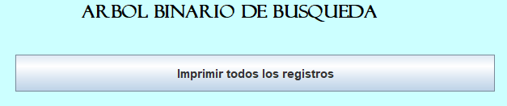
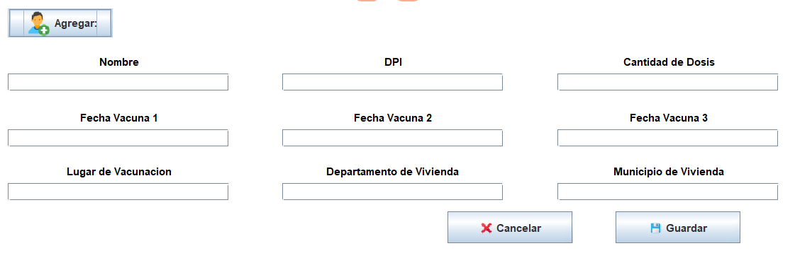
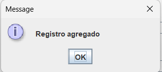

# Validador de vacunas contra covid-19
## Manual de Usuario

Bienvenido, aca se presentará el uso apropiado del sistema desarrollado para la gestion de los datos almacenados sobre los registros de las personas vacunadas contra el Covid-19.

**Interfaz Principal**

En el apartado de configuraciones usted podrá cargar tanto registros normales como registros personalizados a las estructuras de datos, tanto **Arboles Binarios ABB** y **Arboles Binarios AVL**

  

Dentro de cualquiera de este apartado le permitira seleccionar el archivo y cargarlo:

  

Luego podra indicar si desea cargar todos los registros del archivo .txt

  

Si no desea cargar todo, debera indicar cuantos registros desea cargar:

  

### Y los registros se cargaran satisfactoriamente a ambos arboles **Arbol ABB y Arbol AVL**

### Arbol Binario ABB

  
Indicaciones sobre el uso del arbol ABB

  ### Aca Podra Cargar los datos al ABB
  Para ingresar al ABB necesitara precionar el boton **Arbol Binario B**:

  

Luego se mostrara esta ventana:

  

Donde en la parte superior se tendra diferentes opciones entre las cuales son **Inicio**, **Configuraciones**, **Encriptado** y **Compresion**.

El apartado **Inicio** lo que realizar es regresar a la pagina principal:

  

El apartado **Configuraciones** permitira **Guardar el arbol**, **Cargar archivo** y **Cargar Archivo personalizado**, la carga de archivos funciona identico al de la pantalla principal:

  

En el apartado de **Encripcion** nos mostrara la opcion de **Encriptar** y **Desencriptar** donde solo pedira confirmar y automaticamente encriptara o desencriptara los datos del arbol ABB:

  

Por ultimo en el apartado de **Comprension** se mostraran los apartado de **Comprimir en txt** que guardara el arbol comprimido en un txt y **Descomprimir txt** que permitira cargar registros comprimidos y los descomprimirá para ingresarlos al arbol ABB:

  

Luego en el apartado de opciones de Arbol Binario ABB tenemos **Buscar Registro**, **Imprimir todos los registros** e **Imprimir Grafica**

  

 

En el apartado de **Buscar Registro** se nos muestra:

  

 

Ahi se podrá colocar el DPI a buscar, si se encuentra desplegará unos apartados con la información de la persona y mostrará el tiempo de busqueda arriba a la derecha, pero si no se encuentra mostrará un mensaje de no encontrado:

  

 

Luego de eso usted podrá modificar cada uno de los campos presentes, y para guardarlos unicamente tiene que dar click en el boton **Guardar Info.** y los datos se guardarán correctamente. 

  

 

Pero si desea eliminar el registro, debe de presionar el boton **Eliminar Registro**.

  

 

Eso es todo del apartado de **Busqueda** en el apartado de la pantala principal del arbol binario ABB.

Luego se cuenta con el apartado de **Imprimir Registros**.

  

 

Al precionar este apartado se desplegará esta nueva ventana:

  

 

Donde podra recorrer los datos del arbol Binario ABB de las 3 diferentes formas **Pre-Orden**, **In-Orden** y **Post-Orden**.

  

 

Eso es todo del apartado de **Imprimir Todos los Registros** del arbol Binario ABB, luego en la pantalla principal del arbol Binario ABB se cuenta con otro apartado llamado **Imprimir Grafica**

  

 

Al precionar este boton, se mostrará otra ventana donde podra visualizar de forma gráfica el contenido del arbol binario ABB.

  

 

Y por último, en la ventana principal del arbol Binario ABB se tiene un apartado para agregar un nuevo registro

  

 

Al presionar este boton, se despliega un pequeño formulario donde se rellenarán los campos y se cargará al sistema, asegurate de rellenar el No. de DPI y la cantidad de Dosis para que no ocurra ningun problema:

  

 

Luego puede cancelar y ocultar la ventana, o puede guardar el registro y recibirá un mensaje de confirmación:

  

 

Y eso es todo en el apartado del Arbol Binario ABB.

### Arbol Binario AVL

  
Indicaciones sobre el uso del Arbol Binario AVL

  ### Aca podra cargar los datos al Arbol Binario AVL
  
  ### Aca Podra Cargar los datos al AVL
  Para ingresar al AVL necesitara presionar el boton **Arbol AVL**:

  

Luego se mostrara esta ventana:

  

Donde en la parte superior se tendra diferentes opciones entre las cuales son **Inicio**, **Configuraciones**, **Encriptado** y **Compresion**.

El apartado **Inicio** lo que realizar es regresar a la pagina principal:

  

El apartado **Configuraciones** permitira **Guardar el arbol**, **Cargar archivo** y **Cargar Archivo personalizado**, la carga de archivos funciona identico al de la pantalla principal:

  

En el apartado de **Encripcion** nos mostrara la opcion de **Encriptar** y **Desencriptar** donde solo pedira confirmar y automaticamente encriptara o desencriptara los datos del arbol AVL:

  

Por ultimo en el apartado de **Comprension** se mostraran los apartado de **Comprimir en txt** que guardara el arbol comprimido en un txt y **Descomprimir txt** que permitira cargar registros comprimidos y los descomprimirá para ingresarlos al arbol AVL:

  

Luego en el apartado de opciones de Arbol Binario ABB tenemos **Buscar Registro**, **Imprimir todos los registros** e **Imprimir Grafica**

  

 

En el apartado de **Buscar Registro** se nos muestra:

  

 

Ahi se podrá colocar el DPI a buscar, si se encuentra desplegará unos apartados con la información de la persona y mostrará el tiempo de busqueda arriba a la derecha, pero si no se encuentra mostrará un mensaje de no encontrado:

  

 

Luego de eso usted podrá modificar cada uno de los campos presentes, y para guardarlos unicamente tiene que dar click en el boton **Guardar Info.** y los datos se guardarán correctamente. 

  

 

Pero si desea eliminar el registro, debe de presionar el boton **Eliminar Registro**.

  

 

Eso es todo del apartado de **Busqueda**, en el apartado de la pantala principal del arbol binario AVL.

Luego se cuenta con el apartado de **Imprimir Registros**.

  

 

Al precionar este apartado se desplegará esta nueva ventana:

  

 

Donde podra recorrer los datos del arbol Binario AVL de las 3 diferentes formas **Pre-Orden**, **In-Orden** y **Post-Orden**.

  

 

Eso es todo del apartado de **Imprimir Todos los Registros** del arbol Binario AVL, luego en la pantalla principal del arbol Binario AVL se cuenta con otro apartado llamado **Imprimir Grafica**

  

 

Al precionar este boton, se mostrará otra ventana donde podra visualizar de forma gráfica el contenido del arbol binario AVL.

  

 

Y por último, en la ventana principal del arbol Binario AVL se tiene un apartado para agregar un nuevo registro

  

 

Al presionar este boton, se despliega un pequeño formulario donde se rellenarán los campos y se cargará al sistema, asegurate de rellenar el No. de DPI y la cantidad de Dosis para que no ocurra ningun problema:

  

 

Luego puede cancelar y ocultar la ventana, o puede guardar el registro y recibirá un mensaje de confirmación:

  

 

Y eso es todo en el apartado del Arbol Binario ABB.

# Muchas Gracias por Preferir este programa